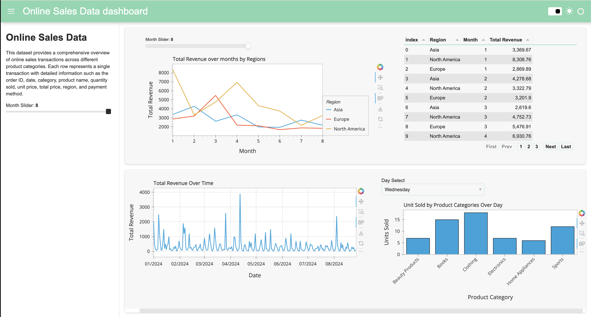

This is a interaction dashboard using Panel in Python. This is the result:



Below is step by step how I create this dashboad. To serve the dashboard locally, clone this repo and use the command:

```
panel serve interactive_dashboard.ipynb
```
